# Banking-App

# Banking Project – Core Architecture Diagram

```mermaid
flowchart TD
%% External Client
Client["Client<br/>(Browser/Mobile/API)"]:::external

%% Security Layer
subgraph "Security Layer"
direction TB
JwtFilter["JwtAuthenticationFilter"]:::security
SecurityConfig["SecurityConfig"]:::security
AuthConfig["AuthConfig"]:::security
JwtService["JwtService"]:::security
CustomUserDetailsService["CustomUserDetailsService"]:::security
CustomUserDetails["CustomUserDetails"]:::security
end

%% API Layer
subgraph "API Layer"
direction TB
AuthController["AuthController"]:::controller
UserController["UserController"]:::controller
AccountController["AccountController"]:::controller
TransactionController["TransactionController"]:::controller
end

%% Service Layer
subgraph "Service Layer"
direction TB
AuthServiceInterface["AuthService (Interface)"]:::service
AuthServiceImpl["AuthServiceImpl"]:::service
UserServiceInterface["UserService (Interface)"]:::service
UserServiceImpl["UserServiceImpl"]:::service
AccountServiceInterface["AccountService (Interface)"]:::service
AccountServiceImpl["AccountServiceImpl"]:::service
TransactionServiceInterface["TransactionService (Interface)"]:::service
TransactionServiceImpl["TransactionServiceImpl"]:::service
ApiSecurityService["ApiSecurityService"]:::service
end

%% Mapper Layer
subgraph "Mapper Layer"
direction TB
AccountMapper["AccountMapper"]:::mapper
UserMapper["UserMapper"]:::mapper
TransactionMapper["TransactionMapper"]:::mapper
AccountResolver["AccountResolver"]:::mapper
TransactionResolver["TransactionResolver"]:::mapper
end

%% Persistence Layer
subgraph "Persistence Layer"
direction TB
UserRepository["UserRepository"]:::repository
AccountRepository["AccountRepository"]:::repository
TransactionRepository["TransactionRepository"]:::repository
end

%% Database
Database["PostgreSQL"]:::database
subgraph "Entities"
direction TB
UserEntity["User Entity"]:::entity
AccountEntity["Account Entity"]:::entity
TransactionEntity["Transaction Entity"]:::entity
end

%% Flows
Client -->|"HTTP Request with JWT"| JwtFilter
JwtFilter -->|"Authenticate/Authorize"| AuthController
JwtFilter -->|"Authenticate/Authorize"| UserController
JwtFilter -->|"Authenticate/Authorize"| AccountController
JwtFilter -->|"Authenticate/Authorize"| TransactionController

AuthController -->|"calls AuthService"| AuthServiceInterface
AuthServiceInterface -->|"implemented by"| AuthServiceImpl
AuthServiceImpl -->|"uses JwtService"| JwtService
AuthServiceImpl -->|"uses CustomUserDetailsService"| CustomUserDetailsService
AuthServiceImpl -->|"uses ApiSecurityService"| ApiSecurityService

UserController -->|"calls UserService"| UserServiceInterface
UserServiceInterface -->|"implemented by"| UserServiceImpl

AccountController -->|"calls AccountService"| AccountServiceInterface
AccountServiceInterface -->|"implemented by"| AccountServiceImpl

TransactionController -->|"calls TransactionService"| TransactionServiceInterface
TransactionServiceInterface -->|"implemented by"| TransactionServiceImpl

UserServiceImpl -->|"maps DTO↔Entity"| UserMapper
AccountServiceImpl -->|"maps DTO↔Entity"| AccountMapper
TransactionServiceImpl -->|"maps DTO↔Entity"| TransactionMapper

AccountMapper -->|"resolves relations"| AccountResolver
TransactionMapper -->|"resolves relations"| TransactionResolver

UserServiceImpl --> UserRepository
AccountServiceImpl --> AccountRepository
TransactionServiceImpl --> TransactionRepository

UserRepository -->|"CRUD"| Database
AccountRepository -->|"CRUD"| Database
TransactionRepository -->|"CRUD"| Database

Database --> UserEntity
Database --> AccountEntity
Database --> TransactionEntity

%% Click Events (may not work on GitHub, use local HTML for full interaction)
click JwtFilter "https://github.com/mlbyl/Banking-Project/blob/master/src/main/java/com/mlbyl/bankingproject/config/JwtAuthenticationFilter.java"
click SecurityConfig "https://github.com/mlbyl/Banking-Project/blob/master/src/main/java/com/mlbyl/bankingproject/config/SecurityConfig.java"
click AuthConfig "https://github.com/mlbyl/Banking-Project/blob/master/src/main/java/com/mlbyl/bankingproject/config/AuthConfig.java"
click JwtService "https://github.com/mlbyl/Banking-Project/blob/master/src/main/java/com/mlbyl/bankingproject/security/jwt/JwtService.java"
click CustomUserDetailsService "https://github.com/mlbyl/Banking-Project/blob/master/src/main/java/com/mlbyl/bankingproject/security/service/CustomUserDetailsService.java"
click CustomUserDetails "https://github.com/mlbyl/Banking-Project/blob/master/src/main/java/com/mlbyl/bankingproject/security/model/CustomUserDetails.java"
click AuthController "https://github.com/mlbyl/Banking-Project/blob/master/src/main/java/com/mlbyl/bankingproject/controller/AuthController.java"
click UserController "https://github.com/mlbyl/Banking-Project/blob/master/src/main/java/com/mlbyl/bankingproject/controller/UserController.java"
click AccountController "https://github.com/mlbyl/Banking-Project/blob/master/src/main/java/com/mlbyl/bankingproject/controller/AccountController.java"
click TransactionController "https://github.com/mlbyl/Banking-Project/blob/master/src/main/java/com/mlbyl/bankingproject/controller/TransactionController.java"
click AuthServiceInterface "https://github.com/mlbyl/Banking-Project/blob/master/src/main/java/com/mlbyl/bankingproject/service/abstracts/AuthService.java"
click AuthServiceImpl "https://github.com/mlbyl/Banking-Project/blob/master/src/main/java/com/mlbyl/bankingproject/service/concrets/AuthServiceImpl.java"
click UserServiceInterface "https://github.com/mlbyl/Banking-Project/blob/master/src/main/java/com/mlbyl/bankingproject/service/abstracts/UserService.java"
click UserServiceImpl "https://github.com/mlbyl/Banking-Project/blob/master/src/main/java/com/mlbyl/bankingproject/service/concrets/UserServiceImpl.java"
click AccountServiceInterface "https://github.com/mlbyl/Banking-Project/blob/master/src/main/java/com/mlbyl/bankingproject/service/abstracts/AccountService.java"
click AccountServiceImpl "https://github.com/mlbyl/Banking-Project/blob/master/src/main/java/com/mlbyl/bankingproject/service/concrets/AccountServiceImpl.java"
click TransactionServiceInterface "https://github.com/mlbyl/Banking-Project/blob/master/src/main/java/com/mlbyl/bankingproject/service/abstracts/TransactionService.java"
click TransactionServiceImpl "https://github.com/mlbyl/Banking-Project/blob/master/src/main/java/com/mlbyl/bankingproject/service/concrets/TransactionServiceImpl.java"
click ApiSecurityService "https://github.com/mlbyl/Banking-Project/blob/master/src/main/java/com/mlbyl/bankingproject/service/ApiSecurityService.java"
click AccountMapper "https://github.com/mlbyl/Banking-Project/blob/master/src/main/java/com/mlbyl/bankingproject/mapper/AccountMapper.java"
click UserMapper "https://github.com/mlbyl/Banking-Project/blob/master/src/main/java/com/mlbyl/bankingproject/mapper/UserMapper.java"
click TransactionMapper "https://github.com/mlbyl/Banking-Project/blob/master/src/main/java/com/mlbyl/bankingproject/mapper/TransactionMapper.java"
click AccountResolver "https://github.com/mlbyl/Banking-Project/blob/master/src/main/java/com/mlbyl/bankingproject/mapper/resolver/AccountResolver.java"
click TransactionResolver "https://github.com/mlbyl/Banking-Project/blob/master/src/main/java/com/mlbyl/bankingproject/mapper/resolver/TransactionResolver.java"
click UserRepository "https://github.com/mlbyl/Banking-Project/blob/master/src/main/java/com/mlbyl/bankingproject/repository/UserRepository.java"
click AccountRepository "https://github.com/mlbyl/Banking-Project/blob/master/src/main/java/com/mlbyl/bankingproject/repository/AccountRepository.java"
click TransactionRepository "https://github.com/mlbyl/Banking-Project/blob/master/src/main/java/com/mlbyl/bankingproject/repository/TransactionRepository.java"
click UserEntity "https://github.com/mlbyl/Banking-Project/blob/master/src/main/java/com/mlbyl/bankingproject/entity/User.java"
click AccountEntity "https://github.com/mlbyl/Banking-Project/blob/master/src/main/java/com/mlbyl/bankingproject/entity/Account.java"
click TransactionEntity "https://github.com/mlbyl/Banking-Project/blob/master/src/main/java/com/mlbyl/bankingproject/entity/Transaction.java"

%% Styles
classDef external fill:#dddddd,stroke:#888888,color:#333333;
classDef security fill:#ffdddd,stroke:#cc0000,color:#660000;
classDef controller fill:#ddeeff,stroke:#0055cc,color:#003366;
classDef service fill:#ddffdd,stroke:#00aa00,color:#003300;
classDef mapper fill:#f0ddff,stroke:#aa00cc,color:#330066;
classDef repository fill:#ffffcc,stroke:#cccc00,color:#666600;
classDef database fill:#e0f7fa,stroke:#006064,color:#004d40;
classDef entity fill:#fff0e0,stroke:#cc6600,color:#663300;
```

## Project Overview

Banking-App is a simple banking application built with Java (SPRING BOOT).  
The project simulates basic banking operations for learning and testing purposes.

>Note: Project is built during the learning process, so the code structure of domains evolves differently.

## Features

Banking-App currently implements the following functionalities:

## 1. User Registration & Login

- Users can **register** with:
  - Full name (name + surname)
  - Date of birth
  - Unique email address
  - Secure password (hashed with Spring Security’s `PasswordEncoder`)
  - Unique phone number  

- During registration:
  - The system checks if the email already exists.
  - Passwords are hashed before being saved in the database.
  - New users are assigned the default role `ROLE_USER`.
  - User accounts are initially created with status **INACTIVE** until first login.

- **Login process:**
  - Users authenticate with their email and password.
  - The `AuthenticationManager` validates credentials.
  - On successful login:
    - A **JWT token** is generated and returned to the client.
    - The token includes `userId` and other claims for authorization.
    - User’s `lastLogin` is updated.
    - User status is set to **ACTIVE** automatically.
  - On failed login, meaningful error messages are returned (`USER_NOT_FOUND`, `INVALID_CREDENTIALS`, etc.).

- **User profile** contains:
  - Full name
  - Date of birth
  - Phone number
  - Email address
  - Role (`ROLE_USER` or `ROLE_ADMIN`)
  - Account status (`ACTIVE`, `INACTIVE`, `SUSPENDED`, `BANNED`)
  - Last login date
  - Accounts and transactions (linked via relationships in the database)

- **Future updates:**
  - Refresh tokens for session management.
  - Email verification during registration.
  - Admin endpoints for managing user roles and statuses.

### 2. Bank Account Management

- Users can create multiple bank accounts linked to their profile.
- Each account has:
  - **Account Number**: A unique 8-character long value, automatically generated.
  - **IBAN**: A 16-character value where:
    - The first 8 characters are a constant development-based bank code (configurable later).
    - The last 8 characters are derived from the account number.
- Accounts support different **Types** (`SAVINGS`, `CHECKING`, `CREDIT`, `LOAN`) defined by an enum.
- Accounts maintain a **Status** (`ACTIVE`, `INACTIVE`, `SUSPENDED`, `CLOSED`, `FROZEN`, `PENDING_APPROVAL`, `DORMANT`) defined by an enum.  
  - By default, newly created accounts are set to `PENDING_APPROVAL`.
  - Status is validated before update and delete operations.  
- Accounts are associated with a **Currency** enum (to be extended with a central bank integration in the future).
- Each account has a **balance** (default: 0.00) stored with high precision (`BigDecimal`).
- Users can view their account details, including balance, account type, status, and currency.
- Accounts have a **lastActivityDate** field that updates whenever the account is modified or deleted, and can be used for automated status transitions (e.g., setting to `DORMANT` after inactivity).
- Accounts are linked to a **User** (one-to-many relationship).
- Accounts are also connected to **Transactions**:
  - `sentTransactions`: All outgoing transfers.
  - `receivedTransactions`: All incoming transfers.
- Security checks ensure:
  - Only the owner of an account can view, update, or delete it.
  - Only `ACTIVE` accounts can be updated.
  - Only `ACTIVE` or `INACTIVE` accounts can be closed (soft-delete by setting status to `CLOSED`).

## 3. Money Transfers
- Users can transfer money between their own accounts or to other users.  
- Transfers require both the sender and receiver accounts to be **ACTIVE**.  
- Validation ensures the sender has sufficient balance before the transfer is processed.  
- Transfers are not allowed to the same account.  
- Both sender and receiver accounts update their `lastActivityDate` upon transfer.  
- All transfers are logged in the `transactions` table with details of sender, receiver, amount, and status.  
- **Future update**: Real-time notifications will be sent to users for successful transfers.  

## 4. Balance Management
- Users can view their account balance at any time.  
- Balance updates are immediate after:  
  - Deposits (crediting the account)  
  - Withdrawals (debiting the account)  
  - Transfers (debit sender, credit receiver)  
- Withdrawals are only allowed from **CHECKING** or **SAVINGS** accounts.  
- Withdrawals and deposits are validated to ensure the transaction amount is greater than zero.  
- Transaction history can be retrieved by `userId` or `accountId`.  

## 5. Payments
- Users can make payments directly from their bank accounts.  
- Payments are processed as **transactions** and stored in the transaction history for full accountability.  
- Currently, payments are a specialization of transfers (from user’s account to a system or merchant account).  
- Payment types can be extended in the future to include:  
  - Loan installments  

## 6. Error Handling & Validation

Banking-App uses a **centralized and standardized approach** for handling errors and validating user input. All API responses conform to a unified structure using the `Result<T>` class, and exceptions extend `BaseException` for consistency.

---

#### Standardized API Responses

All API responses follow a predictable structure:

- `success` (boolean): Indicates whether the operation was successful.
- `data` (generic type): Contains the response payload if available.
- `message` (String): Human-readable message.
- `errorCode` (String, optional): Standardized error code for failures.
- `statusCode` (Integer, optional): HTTP status code for failures.

## 7. Technologies

- **Backend:** Java 17, Spring Boot 3
- **Database:** PostgreSQL
- **Lombok** — reduces boilerplate code
- **Spring Data JPA** — ORM framework
- **Spring Security** — user authentication

---

